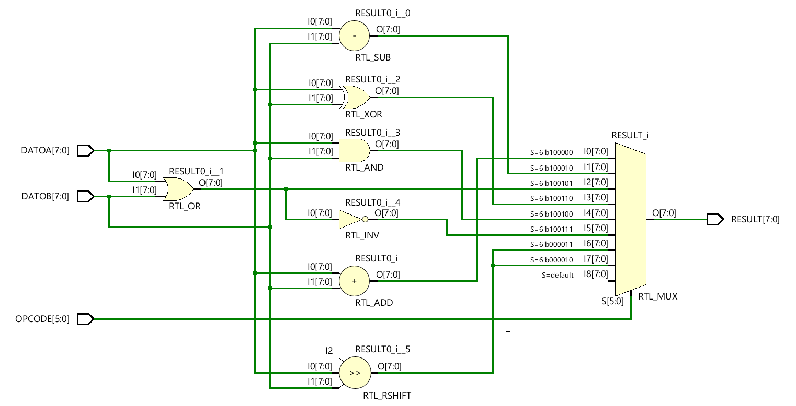
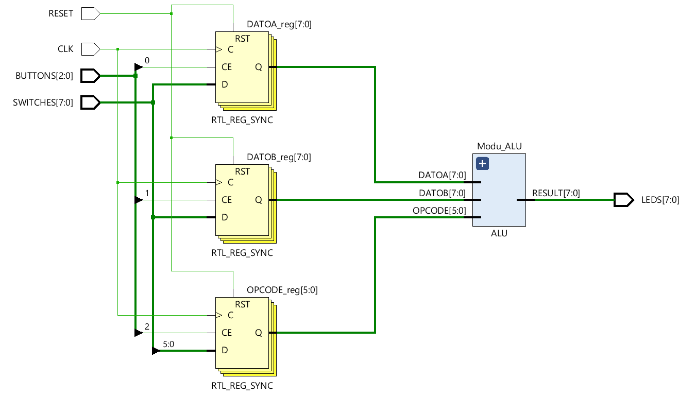
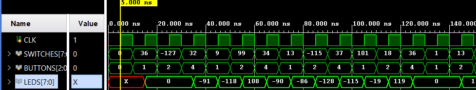
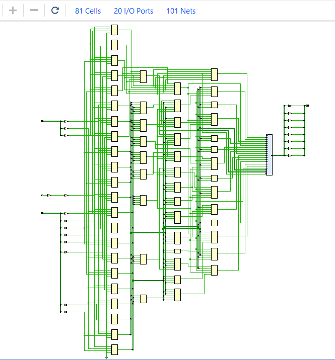
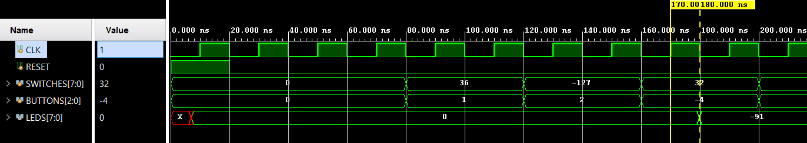
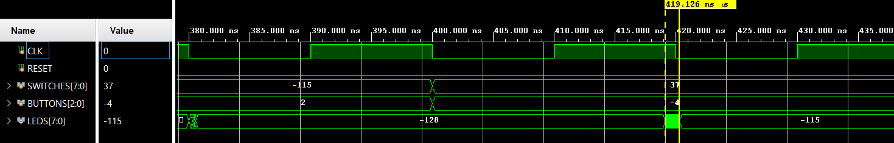
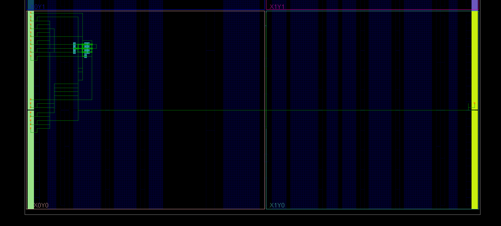

# TP1: ALU
Primer TP de arquitectura de computadoras: ALU

## Francisco Daniele y Julian Gonzalez

### DESARROLLO
El trabajo consiste en desarrollar una ALU para FPGA mediante Verilog y validarla mediante testbench. Para poder diseñar y simular utilizamos Vivado más los conocimientos adquiridos en clases y en la web.
Decidimos seleccionar como placa objetivo la _Basys 3_ de _Digilent_ y creamos dos sources de diseños, uno para la ALU propiamente dicha (_ALU.v_) y otro para la ALU integrada con switches y botones para ingresar datos y leds para ver resultados (_ALU-TOP.v_).
Para las validaciones creamos dos testbenchs diferentes: _ALU-tb.v_ y _TOP-tb.v_.
-    El primero se encarga de validar el funcionamiento de la ALU con assertions "caseros", mediante entradas conocidas y comprobando que el resultado sea el esperado.
-    El segundo es para comprobar que la unidad completa funcione bien, los datos desde los switches a la ALU se pasen bien, y se observen los resultados correctos en los leds. Para esto se incorpora además otro input, CLK, para sincronizar la entrada de datos mediante los switches y botones, y para ver reflejado el resultado de las operaciones.
A continuación se muestran unas imágenes obtenidas de Vivado con sus correspondientes explicaciones.

#### MODULO ALU
Acá podemos ver como sería el circuito lógico de la ALU, que luego se sintetizara cómo LUTs. Tenemos 2 registros de 8 bits (parametrizables) para los operandos y uno de 6 bits para seleccionar las operaciones. Tenemos las "compuertas" lógicas que representan cada operación y un MUX para sacar el resultado correspondiente en el registro de 8 bits de salida.

---
#### ALU "INTEGRADA"
En esta imagen observamos como se conectaría la ALU con las entradas salidas del sistema:
-    8 switches que representan los bits de entrada de datos.
-    3 botones que manejan que entrada de la ALU va a tomar los datos de los switches (uno de los operandos o el OpCode).
-    La entrada de clock.
-    La entrada de reset.
-    Los 8 leds de salida que reciben el resultado.

Se observa como entre medio de la ALU y las entradas hay 3 registros (DATO A, B y opcode) que se sincronizan con el clock y utilizan los botones como chip enable para sacar a su salida lo que corresponda en flanco de clock.

---
#### SIMULACION RTL
Aquí podemos ver una corrida _RTL simulation_ del testbench _TOP-tb.v_ que genera una señal de clock y cada 10ns genera un dato random y lo coloca, mediante los botones, secuencialmente en DATOA, DATOB y OPCODE. En flanco ascendente de clock se ve reflejado el cambio en los leds (resultado) dependiendo del estado de las entradas. 

---
#### SINTESIS
En la síntesis se ve como quedaría todo el sistema ya sintetizado. Utiliza:
-    82 cells: IBUFs y OBUFs buffers para las entradas y salidas, FDREs registros de bit para la entradas de la ALU (DATOA, DATOB y OPCODE) y LUTs para el funcionamiento de la ALU.
-    21 I/O ports: 8 entradas switches, 3 entradas botones, 1 entrada clock, 1 entrada reset y 8 salidas leds.
-    102 nets.

---
#### SIMULACION POST-SINTESIS
Luego de la simulacion de timing post-sintesis, obtenemos la siguiente imagen, en el cual pudimos observar que el circuito combinacional de la ALU demora aproximadamente 10 ns en procesar un resultado (marcadores amarillos). Por esta razon, decidimos que el periodo de clock sera de 20 ns.
Tambien, observamos que cuando testeamos, despues de le damos la señal de reset, y enseguida nos poniamos a pasar datos a la ALU medianto los switches, estos no eran captados correctamente. Por lo tanto, esperando un corto tiempo que suponemos que es de inicializacion del sistema, ya no se observa este problema. 

En esta simulacion tambien podemos ver el jitter del sistema, que es un ruido indeseado causado por una pequeña desviacion de la señal clock, el mas extenso siendo de aproximadamente 1 ns como se observa en la imagen.  

---
#### IMPLEMENTACION
Aquí vemos como quedaría implementado el circuito sintetizado en la FPGA (los bloques celestes).
Se ve en la parte derecha aislado el clock, y a la izquierda, en los I/O banks los restantes 20 puertos utilizados.
Los demás bloques celestes son las 82 celdas utilizadas.

