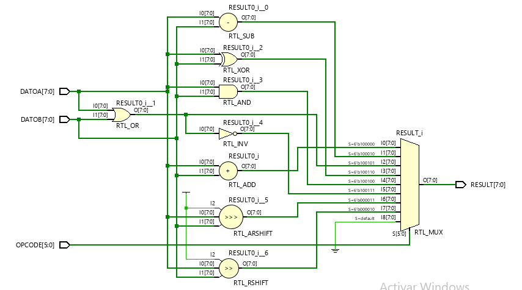

# TP1: ALU
Primer TP de arquitectura de computadoras ALU

## Francisco Daniele y Julian Gonzalez

### DESARROLLO
El trabajo consiste en desarrollar una ALU para FPGA mediante Verilog y validarla mediante testbench. Para poder diseñar y simular utilizamos Vivado más los conocimientos adquiridos en clases y en la web.
Decidimos seleccionar como placa objetivo la _Basys 3_ de _Digilent_ y creamos dos sources de diseños, uno para la ALU propiamente dicha (_ALU.v_) y otro para la ALU integrada con switches y botones para ingresar datos y leds para ver resultados (_ALU-TOP.v_).
Para las validaciones creamos dos testbenchs diferentes: _ALU-tb.v_ y _TOP-tb.v_.
-    El primero se encarga de validar el funcionamiento de la ALU con assertions "caseros", mediante entradas conocidas y comprobando que el resultado sea el esperado.
-    El segundo es para comprobar que la unidad completa funcione bien, los datos desde los switches a la ALU se pasen bien, y se observen los resultados correctos en los leds. Para esto se incorpora además otro input, CLK, para sincronizar la entrada de datos mediante los switches y botones, y para ver reflejado el resultado de las operaciones.
A continuación se muestran unas imágenes obtenidas de Vivado con sus correspondientes explicaciones.

#### MODULO ALU
Acá podemos ver como sería el circuito lógico de la ALU, que luego se sintetizara cómo LUTs. Tenemos 2 registros de 8 bits (parametrizables) para los operandos y uno de 6 bits para seleccionar las operaciones. Tenemos las "compuertas" lógicas que representan cada operación y un MUX para sacar el resultado correspondiente en el registro de 8 bits de salida.

#### ALU "INTEGRADA"
En esta imagen observamos como se conectaría la ALU con las entradas salidas del sistema:
-    8 switches que representan los bits de entrada de datos
-    3 botones que manejan que entrada de la ALU va a tomar los datos de los switches (uno de los operandos o el OpCode)
-    La entrada de clock
-    Los 8 leds de salida que reciben el resultado
Se observa como entre medio de la ALU y las entradas hay 3 registros (operando 1, 2 y opcode) que se sincronizan con el clock y utilizan los botones como chip enable para sacar a su salida lo que corresponda en flanco de clock.

#### SIMULACION

#### SINTESIS

#### IMPLEMENTACION

